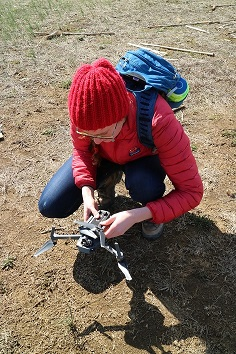
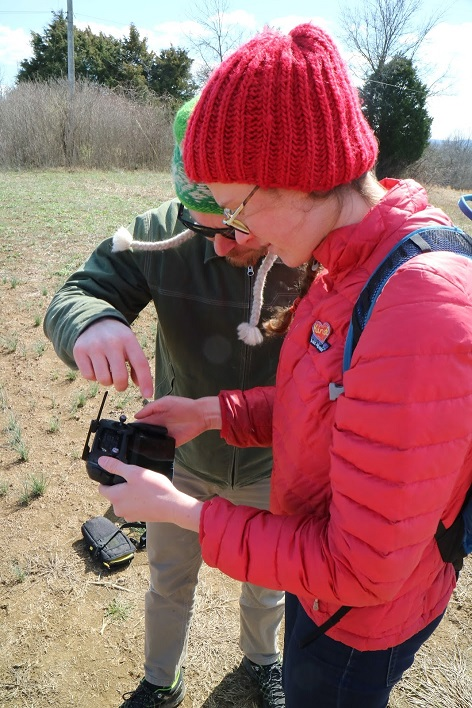
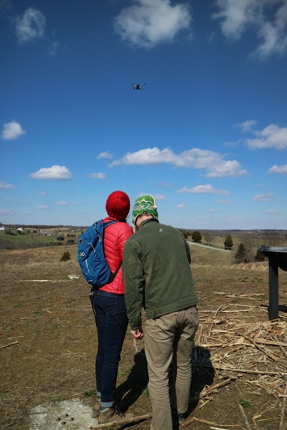
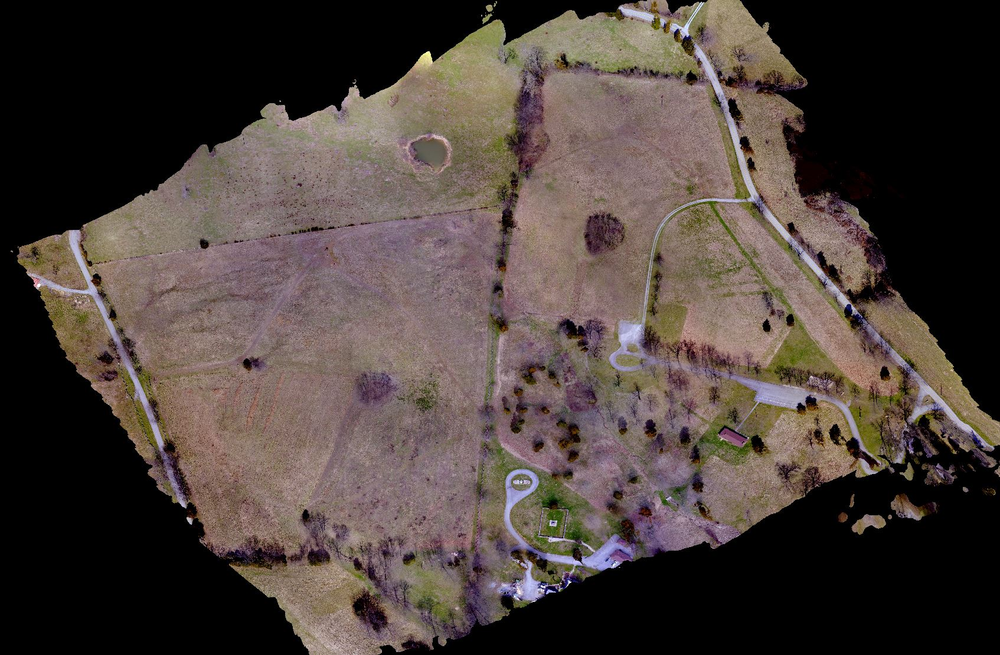
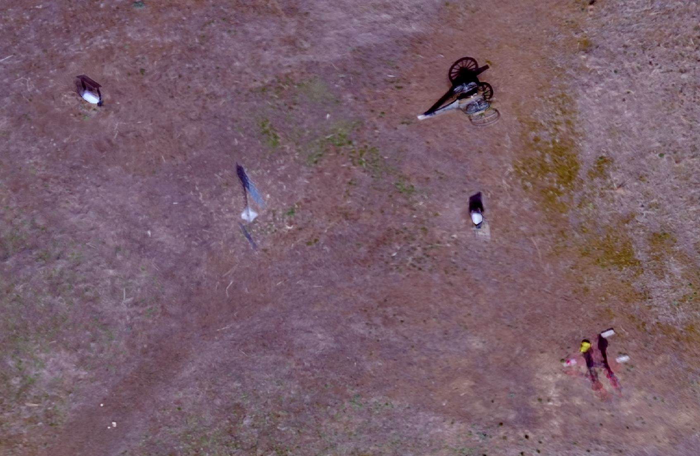
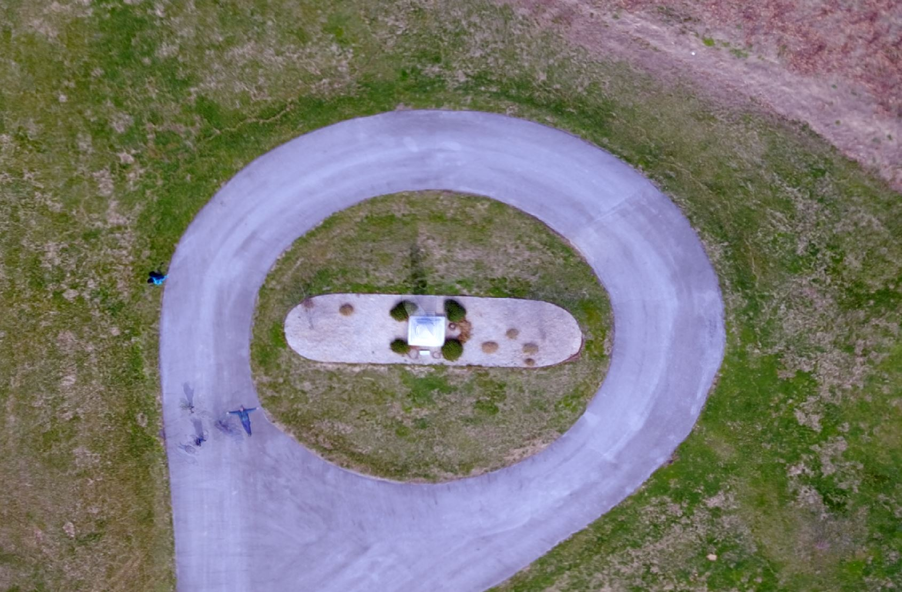
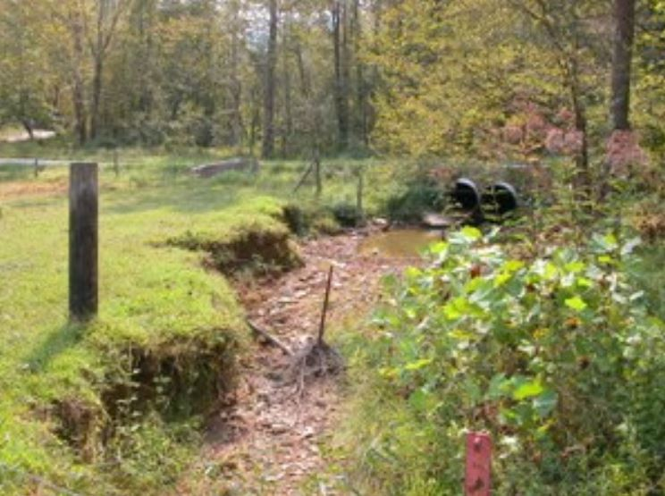
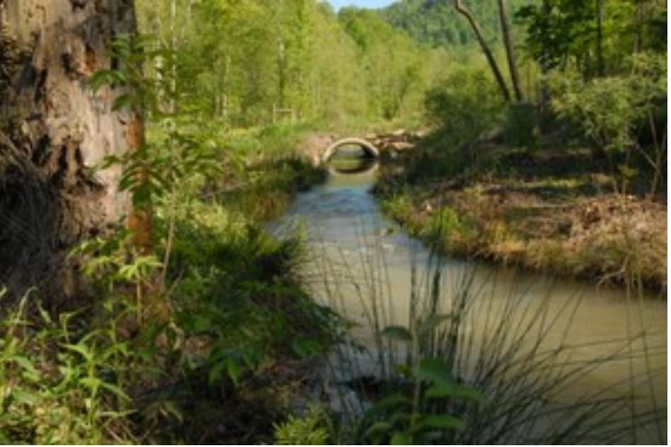
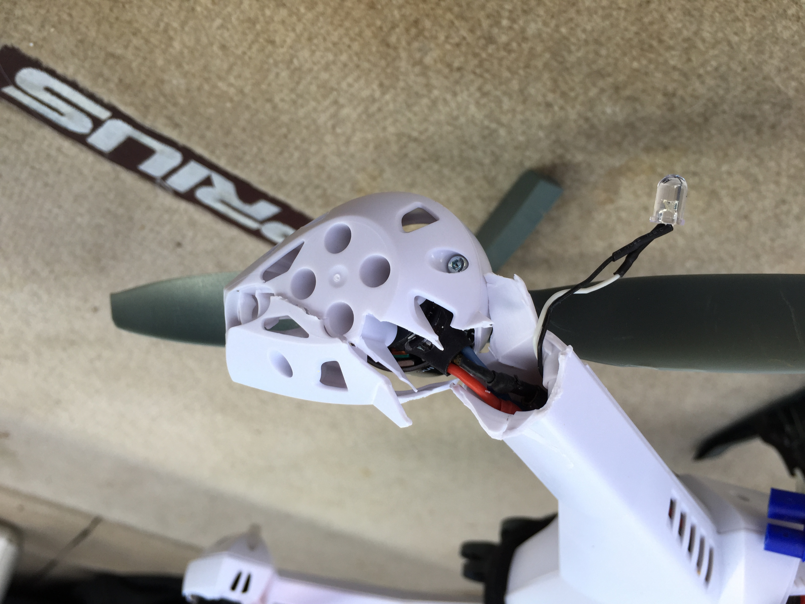
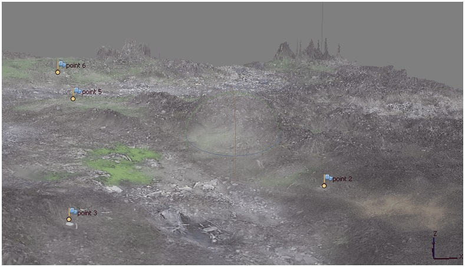

1/11/2019 1:42:15 PM @title[unmanned aerial systems research]
### small unmanned aerial systems (suas):
#### an overview
##### GEOG 390/590 Spring 2019
---
@title[the plan]
### the plan
- A Brief History of UAS
- 
- UAS Mapping Operations
- Structure from Motion Image Processing
- UAS Research at UofL 
---
@title[Overview of the UAS Landscape]
### A definition
> Unmanned Aerial Systems (UAS) consist of...
> - an unmanned aerial vehicle (UAV/RPV/drone)
> - a ground-based controller/operator
> - communications between the two
---
@title[Modern small UAS]
### Modern small UAS/imaging drones
- Standard Elements
 - UAV/drone 
 - Mission planning element
 - Command and control element
+++
### Modern small UAS/imaging drones
- Standard Elements
 - Communication link
 - Payload (cameras/sensors/etc)
 - Launch and recovery element (if required)
---
### Modern small UAS/imaging drones
#### Fixed wing vs multirotor
- Fixed wing
 - Simpler structure
 - Greater endurance/flight time
 - Bigger payloads (larger sensors)
 - No stationary flight
+++
### Modern small UAS/imaging drones
#### Fixed wing vs multirotor
- Multirotor
 - vertical takeoff and landing
 - hovering/precise maneuvering
 - more complex (mechanically and electronically)
 - shorter flight times/smaller payloads
+++
### Fixed wing: eBee

+++
### Fixed wing: Trimble UX5

+++
### Fixed Wing: 3DR Aero-M

+++
### Multirotor: DJI Phantom

+++
### Multirotor: DJI Mavic Pro

+++
### Multirotor: 3DR X8

+++
### Multirotor: DJI Matrice

+++
### Meow-lti-rotor: Orville the Drone Cat

---
### small UAS Regulatory Landscape 
- Hobbyist/Recreational Use: No license required! BUT!
 - < 55lbs
 - flown within visual line-of-sight of operator
 - Notify ALL airports/helipads within 5 mi.
+++
### small UAS Regulatory Landscape
- Commercial Operations
 - Fly under FAA Part 107 Rules
 - Register UAS with FAA
 - Obtain Part 107 Remote PIC license
+++
### FAA Part 107 Rules
- <=400ft AGL 
- Daytime only
- Never over people
- [Permission required in special airspace (< 5mi from controlled airports)](https://app.airmap.io/)
- [FAA Part 107 Summary](https://www.faa.gov/uas/media/Part_107_Summary.pdf)
---
### Mapping applications of small UAS
- Aerial Photography/Orthomosaics
- Topographic Mapping/Digital Terrain Modelling
- Photogrammetry/Volumetric Survey
- IR/Thermal analysis
- Vegetation mapping
+++
### Mapping applications of small UAS
- Structure from Motion (SfM) image processing
 - 3D reconstruction based on point matching between overlapping images
 - Same principle as stereoscopic imagery
  - **parallax**: displacement of an object caused by a change in the point of observation
+++

+++
### Mapping applications of small UAS
- Generalized processing steps:
  1. Feature detection/image matching
  2. Point cloud generation
  3. Ground Control Point (GCP) specification (optional)
  4. Point cloud densification
  5. Mesh generation
  6. Orthomosaic/Digital Surface Model Generation
+++
### Image Processing in Pix4DMapper Pro

+++
### Image Processing in AgiSoft Photoscan

---
### UAS Research Group at UofL
- Small cohort of faculty, staff, and students
- Fleet of drones:
 - 2 x DJ Mavic Pro, 1 x DJI Phantom 4 Pro, 2 x 3DR X8, 2 x 3DR Aero
- Parrot Sequoia NIR sensor for vegetation applications
- GNSS equiment for ground control survey
- 2 FAA licensed Part 107 Remote Pilots
- Workstations and SfM software for processing imagery
+++
### UAS Research Group at UofL 
- Recent/Ongoing Projects
 - Perryville Battlefield site mapping and modelling
 - UofL Stream Institute stream restoration site mapping
 - Kavango Zambezi Vulnerability and Adaptation (KAZAVA) Project 
---
@title[Perryville Battlefield Mapping Project]
### Perryville Battlefield Mapping
###### Interdisciplinary Research Project
- Collaboration with Dr. Daniel Krebs (History Dept)
- Broad Objective: Using geospatial technology to map, model, analyze, and interpret the Civil War battle of Perryville
- Funding through the Commonwealth Center for Humanities and Society
+++
### Perryville Battlefield Mapping
- Multiple components: 
 - Georeferencing historic maps |
 - Interpreting and capturing spatial data from historic texts |
 - Time series analysis to model and interpret progression of troops during battle |
 - Terrain analysis to understand impact of topography on tactical advantages for Confederate Army |
+++
### Perryville Battlefield Mapping
###### Background Information
- October 8th, 1862
- Confederate General Braxton Bragg makes camp with his army on Doctor's Creek near Perryville
- Union Army, led by Gen. Don Carlos Buell, pursues Bragg from the west
+++
### Perryville Battlefield Mapping
###### Background Information
- Knobs to the west of town provide high ground for defensive positions for Bragg's soldiers
- Bragg orders attack on Union positions, but Union army uses cloak of hilly terrain to surprise advancing Confederates. 
- Repeatedly, Union forces retreated before General Bragg's men and established new defensive lines on another ridge.
+++
### Perryville Battlefield Mapping
###### Background Information
- Depressions and hills were not obvious to soldiers during the battle and led to a series of tragic mistakes by commanders on both sides.
- Units found themselves in the midst of withering crossfire because the terrain had forced them into an unfavorable position.
- At the same time, this terrain led to a phenomenon called acoustic shadow. Union General Don Carlos Buell, hence, could not hear the battle from his headquarters and did not send vital reinforcements on time
+++
### Perryville Battlefield Terrain Analysis
- Using digital terrain data from LiDAR and UAS, recreate the setting of the battle:
 - How tall was the corn in early October? What was its impact on sightlines?
 - How tall and dense was the forest separating the battlefield from Buell's position to the West?
 - How many decibels are created by a 10 lb cannon? Under atmospheric conditions in early October?
 - Can we model the acoustic shadow? 
+++ 
### Perryville UAS Field Operations
- First large-scale mapping effort by UofL 
- 2 flights conducted on March 3rd, 2017.
- 60 acres mapped at a resolution of 2 cm
- High winds, cold temperatures, and equipment failures presented difficult conditions
- No ground control used, image EXIF data only 
+++ 

+++ 

+++ 

+++ 

+++

##### Orthophoto
+++ 

##### Cannon Detail
+++ 

##### Vegetation Detail
+++ 

##### Drone Angel!
+++
### Next Steps
- Refly area using ground control points for increased accuracy
- Process imagery in Pix4D Mapper Pro
- Derive historic vegetation characteristics from maps and texts
- Generate 3D model for terrain analysis
- Create series of 3D and timeenabled story maps for reinterpretation of battle
---
### UofL Stream Institute 
###### Stream Restoration Mapping
- Collaboration with Speed School Stream Institute
- Stream restoration projects design and build stream and wetland ecosystems
- Strip existing vegetation from site, dig/reinforce new stream channel, grade floodplain
- Miitigate erosion, promote healthy vegetation communities, aquatic life
+++

Mill Branch, Knox County, KY before stream restoration
+++

Mill Branch, Knox County, KY after stream restoration
+++
### UofL Stream Institute
###### Stream Restoration Mapping
- Improve process and add value for existing stream restoration project workflow
- UAS-derived "As Built" survey as substitute for time consuming and expensive ground survey
- Can low-cost UAS data provide accuracy necessary for precise engineering applications?
 - Horizontal and vertical accuracy of digital elevation product paramount
+++
### Early Efforts
- Moody Lane site in Oldham County
- Mission flown using a Blade QX4 UAV with a GoPro camera
- This combo does not encode coordinate information to image EXIF data
- Even with ground control, resulting image quality was lacking
- GPS navigation system also of poor reliability
+++

+++

+++

+++

+++

+++

+++
### Stream Mapping 2.0

https://www.dronedeploy.com/app2/data/59c9bd7d52db903288ddf60d 
 

