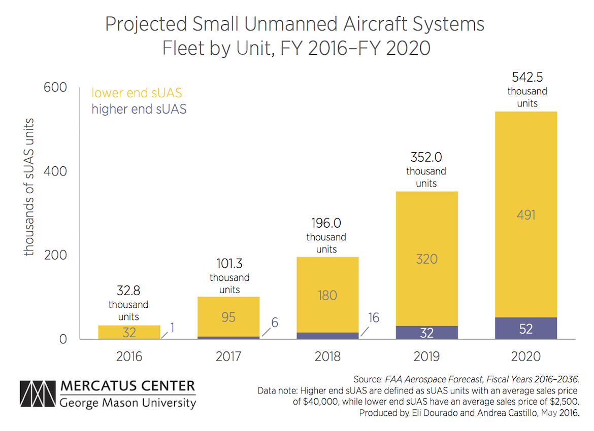
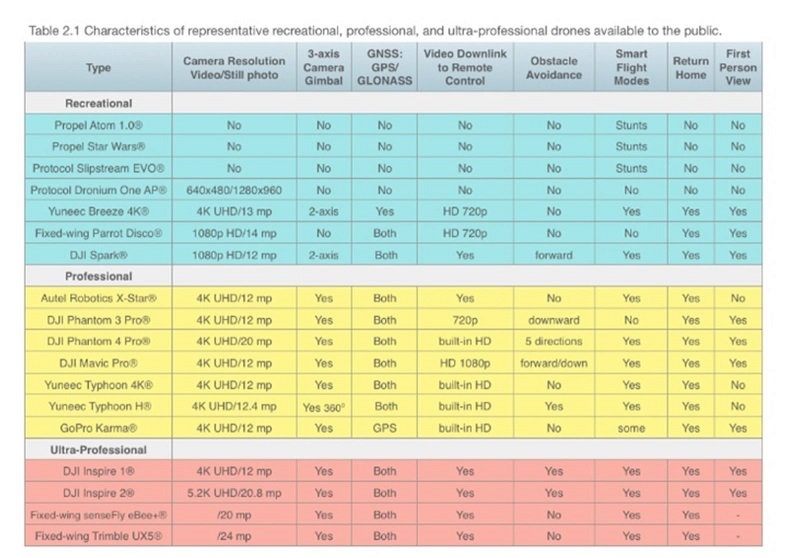
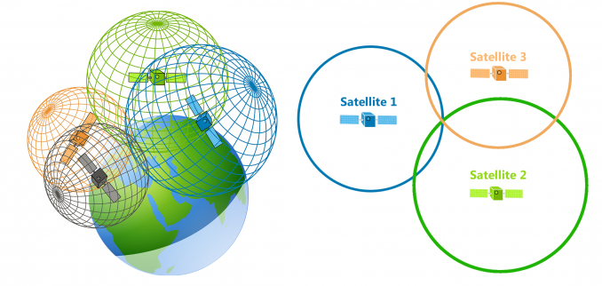

@title[unmanned aerial systems research]
### small unmanned aerial systems (suas):
#### an overview
##### GEOG 390/590 Spring 2019
---
@title[the plan]
### the plan
- A Brief History of UAS
- UAS Systems Overview
- UAS Subsystems
- Accessories
- UAS Softwares
---
@title[A Brief History of UAS]
## A brief history of UAS
- A military innovation at the outset...
+++

###### [Chinese paper lanterns circa 200CE](https://www.e-education.psu.edu/geog892/node/643)
+++

###### [Balloon bombs (Civil War thru WWII)](https://en.wikipedia.org/wiki/History_of_military_ballooning)
+++

###### [Oregon Balloon Bombing of 1945](https://en.wikipedia.org/wiki/Fire_balloon)
+++

###### [British and U.S. radio-controlled aircraft (1930s)](http://www.vintagewings.ca/VintageNews/Stories/tabid/116/articleType/ArticleView/articleId/484/The-Mother-of-All-Drones.aspx)
+++

###### [British and U.S. radio-controlled aircraft (1930s)](http://www.navalaviationmuseum.org/attractions/aircraft-exhibits/item/?item=n2c)
+++

###### [British and U.S. radio-controlled aircraft (1930s)](http://www.vintagewings.ca/VintageNews/Stories/tabid/116/articleType/ArticleView/articleId/484/The-Mother-of-All-Drones.aspx) 
+++

###### [Ryan Firebee (Vietnam era)](https://gizmodo.com/the-ryan-firebee-grandfather-to-the-modern-uav-1155938222)
+++

###### [Ryan Firebee (Vietnam era)](https://gizmodo.com/the-ryan-firebee-grandfather-to-the-modern-uav-1155938222)
+++

###### [Predator/Reaper drone (current era)](https://foxtrotalpha.jalopnik.com/the-air-force-is-retiring-the-predator-drone-for-the-mo-1792832541)
+++
Beyond military applications...

+++
The FAA has awarded over 100,000 Part 107 RPIC Certifications in the first two years of the program!
---
### Modern Small Unmanned Aerial Systems
+++
### A definition
> Unmanned Aerial Systems (UAS) consist of...
> - an unmanned aerial vehicle (UAV/RPV/drone)
> - a ground-based controller/operator
> - communications between the two
---
@title[Modern small UAS]
### small UAS/imaging drones
- Standard Elements
 - UAV/drone 
 - Mission planning element
 - Command and control element
+++
### small UAS/imaging drones
- Standard Elements
 - Communication link
 - Payload (cameras/sensors/etc)
 - Launch and recovery element (if required)
---
### [UAS Classifications](https://shemesh.larc.nasa.gov/people/jmm/NASA-TM-2013-217969.pdf)
Many ways to group...

+++
### [UAS Classifications](https://shemesh.larc.nasa.gov/people/jmm/NASA-TM-2013-217969.pdf)

+++
### UAS Classifications
##### For our purposes...
> Weight: <55 lb  
> Speed:  <87 knots  
> Altitude: <400' AGL
---
### small UAS/imaging drones
#### Fixed wing vs multirotor
- Fixed wing
 - Simpler structure
 - Greater endurance/flight time
 - Bigger payloads (larger sensors)
 - No stationary flight
+++
### small UAS/imaging drones
#### Fixed wing vs multirotor
- Multirotor
 - vertical takeoff and landing
 - hovering/precise maneuvering
 - more complex (mechanically and electronically)
 - shorter flight times/smaller payloads
+++
### Fixed wing: SenseFly eBee

+++
### Fixed wing: Trimble UX5

+++
### Fixed Wing: 3DR Aero-M

+++
### Multirotor: DJI Phantom

+++
### Multirotor: DJI Mavic Pro

+++
### Multirotor: 3DR X8

+++
### Multirotor: DJI Matrice/Inspire

+++
### Common UAS models

+++
### Meow-lti-rotor: Orville the Drone Cat

---
### UAS Subsystems
UAS systems consist of a number of different subsystems fulfilling various functions...
- 1.) Airframe and Powerplant |
- 2.) Flight Control and State Estimation |
- 3.) Communications |
- 4.) Imaging Systems |
+++
### Airframe and Powerplant
The UAS body/chassis, and the parts that make it "go".
+++
### General Anatomy
#### Multirotor

+++
### General Anatomy
#### Fixed Wing

+++ 
### Boom/Motor Mount/Motors
 
+++
### Brushless Stator Motors

+++
### Battery Systems
Typically *Lithium Polymer (LiPo)* types: Lightweight, charge quickly, and have *intelligent* battery management.
+++
### Battery Systems
Flight times range from 15-25 minutes for a singe DJI quad battery...bring extras! 
+++
### Propellers/Rotors
A rotor is simply an *airfoil*, like an airplane wing.
+++
### Propellers/Rotors
It creates *lift* to overcome the *weight* of the aircraft
+++
### Propellers/Rotors
*Bernoulli's Principle* states that as a fluid (like air) is accelerated, its pressure decreases. 
+++
### Propellers/Rotors

+++ 
### Propellers/Rotors
Why is a rotary wing shaped the way it is?

+++
### Multirotor Flight
How does a multirotor UAV achieve directional flight?
+++
### Multirotor Flight
First we need to know how the four forces interact to create motion in the three axes of flight.
+++
### Multirotor flight
##### The Four Forces
- Lift |
- Weight |
- Thrust |
- Drag |
+++
### Multirotor Flight
- To go **UP**:  
  - Lift > Weight | 
- To go **DOWN**:
  -  Weight > Lift | 
- To go **FORWARD**: 
  - Thrust > Drag |
- To **HOVER**: 
  - Lift = Weight and Thrust = Drag | 
+++
### Multirotor Flight
##### Three axes of flight
- Pitch (nose up/down) |
- Roll (wings tilt left/right) |
- Yaw (nose moves left/right) |
+++
### Multirotor Flight
##### Three axes of flight

+++
### Multirotor Flight
#### Putting it together

---
### Flight Control and State Estimation Systems
- Autopilot/Flight Computer
- Inertial Measurement Units
- Accelerometer
- MEMS Gyroscopes
- Magnetometer
- Air data computers
- GPS/GNSS Navigation components
+++
#### Autopilot/Flight Computer
The *brain* of the drone, receiving information from various onboard sensors and control inputs from the remote controller, and translating them to adjustments to motor RPMs.
+++
#### Autopilot/Flight Computer
https://www.dronetrest.com/t/beginners-guide-to-drone-autopilots-flight-controllers-and-how-they-work/1380
+++
#### Inertial Measurement Unit 
Measure changes to the acceleration and orientation of the drone in order to resist external forces like wind, and to monitor response to control inputs. Calculates the aircraft's **ATTITUDE**.
+++
#### Accelerometers
Calculate acceleration forces through piezoelectric or capacitance based measurements.

+++
#### MEMS Gyroscopes
Measure pitch/roll/and yaw
Micro Electric Mechanical Systems

+++
#### Magnetometer
A sensor that measures *magnetism*, including the Earth's magnetic field. Measurements from a *properly calibrated* magnetometer can be used as a compass.  
+++
#### Magnetometer
In a UAV, a magnetometer can measure the aircraft's *heading*, or its direction relative to North.  
+++
#### Magnetometer
Caution: Magnetometers suffer greatly from *interference* caused by other electromagnetic devices  
+++
####  Air Data Computer
Measures physical properties of the atmosphere, including temperature, atmospheric pressure, air speed, and altitude.
+++
#### Air Data Computer
##### Barometers
Measures static air pressure, usually relative to the value measured at take off. A change in altitude corresponds to a proportional change in air pressure, and thus pressure readings may be used to calculate aircraft height AGL. 
+++ 
#### GPS/GNSS Navigation
A GPS/GNSS receiver and antenna calculates the aircraft's location and altitude through *trilateration* by measuring the *range* to a number of navigational satellites.
+++

#### GPS/GNSS Navigation
The *range* to a satellite is calculated from the propagation time of the satellite's transmission, which travels at the...
- Speed of light |
+++
#### GPS/GNSS Navigation

+++
#### GPS/GNSS Navigation
GNSS drives many functions of the autopilot, including return to home, waypoint navigation/flight planning, automated "no fly" areas, etc.
+++
#### GPS/GNSS Navigation
*Real time kinematic (RTK)* GNSS receivers can correct for various GNSS trilateration errors to greatly improve location accuracy. Found only on very high end drones.
+++
#### DJI Phantom RTK

---
### Communications Systems

